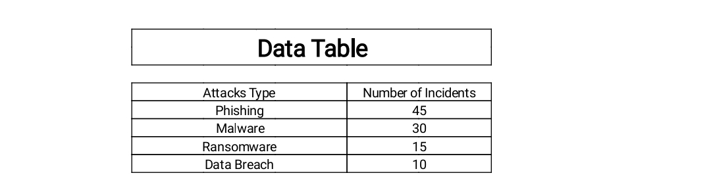
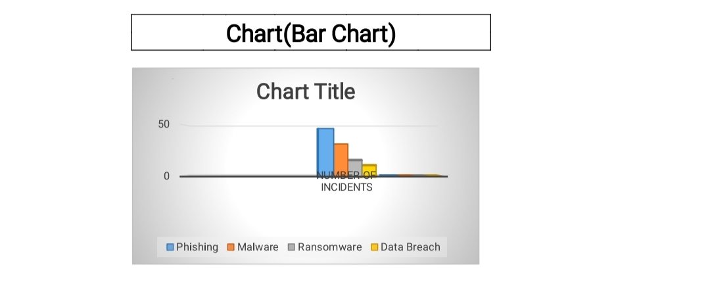
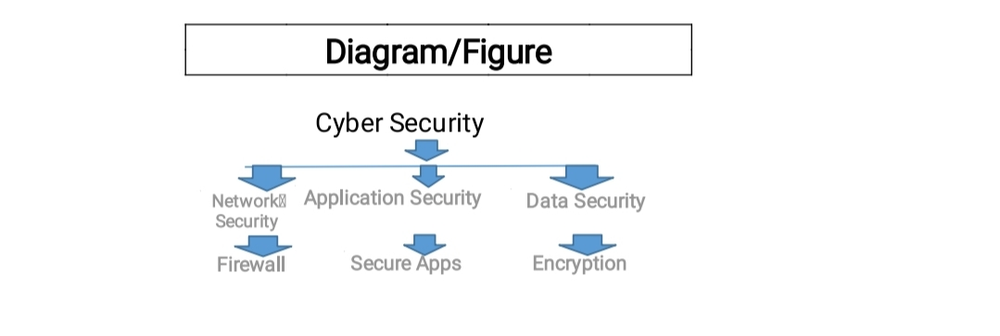

# 📚 SEU-CSE1102-GS1001

> **Course:** CSE1102 | **Group:** GS1001 | **Project Topic:** Cyber Security

---

## 📖 Project Overview
This project explores the fundamental concepts of Cyber Security, including common threats, protection methods, and best practices for individuals and organizations. We analyzed recent cyber attack trends and provided practical recommendations to enhance digital safety in our daily lives and workplaces.

---

### 👨‍🏫 Instructor

| Name                | Role              | GitHub |
|---------------------|-------------------|--------|
| Tashreef Muhammad   | Course Instructor | [Tashreef Muhammad](https://github.com/TashreefMuhammad) |

---

## 👥 Group Members

| SL | Name                        | Student ID         |
|----|-----------------------------|--------------------|
| 1  | Emtahanul Islam Enan        | 2026000000296      |
| 2  | Md. Sohan Sheikh            | 2026000000287      |
| 3  | Labonna Saha Joyeta         | 2026000000271      |

---

## 🔄 Project Workflow

1. Topic selection and proposal approval
2. Research on cyber security concepts and latest attack statistics
3. Data collection from reliable sources
4. Data analysis and visualization in Excel
5. Insight generation and recommendation development
6. Report writing and presentation slide preparation

---

## 📊 Key Visualizations

**Data Table - Cyber Attack Statistics**

**Bar Chart - Number of Incidents by Attack Type**

**Cyber Security Components Diagram**

---

## 📊 Spreadsheet Explanation
The `/excel` folder contains our main dataset of recent cyber attacks. We performed:
- Data cleaning and filtering
- Pivot tables for attack type distribution
- Creation of charts and summary statistics

---

## 🤖 Use of AI Tools

- Grok AI: Helped with structuring the report, generating workflow, and improving README
- ChatGPT: Assisted in content research and grammar checking
- Microsoft Copilot: Supported in slide design and formatting

---

## 📈 Contribution of Each Member

| Member                    | Major Contributions                              |
|---------------------------|--------------------------------------------------|
| Emtahanul Islam Enan      | contributed by creating some of the presentation slides and settings up GitHub account. |
| Md. Sohan Sheikh          | conducted detailed research on the topic and prepared the presentation slides based on the collected information. |
| Labonna Saha Joyeta       | preparing the report, creating the data table in Microsoft Excel, and designing the bar chart.Also assisted other team members whenever needed |

## 📚 References

1. Cybersecurity and Infrastructure Security Agency (CISA).  
2. National Institute of Standards and Technology (NIST).  
3. Cisco Cybersecurity Resources.  
4. IBM Security Learning Center.

---
